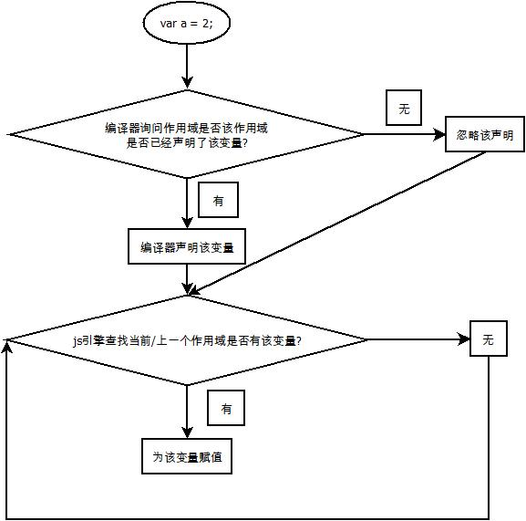

# 一 作用域
## 1 js引擎进行编译过程（在执行前）
- js引擎： 可以根据需要创建并存储变量
- 词法分析(Tokenizing/Lexing)
    - 将由字符组成的字符串分解成有意义的代码块
- 语法分析
- 代码生成
    - 将var a = 2;的AST转化为一组机器指令，用来创建一个叫做a的变量（包括分配内存等），并将一个值存储在a中
## 2 理解作用域
### 2.1 认识三个对话的部分
- 引擎
    - 从头到尾负责整个js程序的编译及执行过程
- 编译器
    - 负责语法分析即代码生成等等
- 作用域
    - 负责收集并维护所有声明的表示符组成的一系列查询，并实施一套非常严格的规则，确定当前执行的代码对这些标识符的访问权限
### 2.2 对话的过程
- 
### 2.3 js引擎查询变量的方法
- LHS查询
    - 查询变量是否已经声明后并给它赋值
- RHS查询
    - 变量已经赋值，查询变量的值
```javascript 
    function foo(a) {
        console.log(a)
    }

    foo(2);
    // a = 2 为LHS查询
    // console.log(a) 为RHS查询
```
- 练习
    - 引擎和作用域的对话
``` javascript
    function foo(a) {

    }
    var c = foo(2)
    /**
    * 三次LHS查询
    *   1 调用函数时，a需要进行LHS引用
    *   2 b需要进行LHS引用
    *   3 c需要进行LHS引用
    * 四次RHS查询
    *   1 调用foo函数：js引擎询问在该作用域当中有没有foo函数
    *   2 赋值b时，js询问a的值
    *   3 在return时，询问a,b的值
    *   4 赋值c时，js询问函数的返回值
    */
```
    - 认清语法LHS和RHS的重要性
```javascript
    function foo(a) {
        console.log(a + b);
        b = a;
    }

    foo(2)
    /*
    *   b是一个未声明的变量，所以进行RHS查询时无法找到，是一个undefined类型，抛出ReferenceError
    *                        若RHS查询对变量进行不符合规范的引用，如变量不是函数全被调用成函数, 抛出TypeError
    *   对b进行LHS查询，由于b没有声明，若在非严格模式下，js引擎会自动帮你创建一个全局变量
    *                                  若严格模式下, js引擎会抛出ReferenceError
    */
```

### 2.3 作用域嵌套
- 当一个块或函数嵌套在另一个块或函数中时，就发生了作用域的嵌套。
    - 以{}符号作为一个块
- 遍历作用域链的过程
    - 在当前作用域中无法找到某个变量时，引擎就会在外层嵌套的作用域中继续查找，直到找到该变量，或抵达最外层的作用域（也就是全局作用域）为止
### 2.4 总结
- 作用域是一套规则，用于确定在何处以及如何查找变量（标识符）
- 如果查找的目的是对变量进行赋值，那么就会使用 LHS 查询；如果目的是获取变量的值，就会使用 RHS 查询。
- JavaScript 引擎首先会在代码执行前对其进行编译，在这个过程中，像 var a = 2 这样的声明会被分解成两个独立的步骤：
    - 首先，var a 在其作用域中声明新变量。这会在最开始的阶段，也就是代码执行前进行。
    - 接下来，a = 2 会查询（LHS 查询）变量 a 并对其进行赋值。
- 遍历作用域链
    - LHS 和 RHS 查询都会在当前执行作用域中开始，如果有需要（也就是说它们没有找到所需的标识符），就会向上级作用域继续查找目标标识符，这样每次上升一级作用域（一层楼），最后抵达全局作用域（顶层），无论找到或没找到都将停止。
- 异常抛出
    - 不成功的 RHS 引用会导致抛出 ReferenceError 异常。（没有进行声明）
    - 不成功的 LHS 引用会导致自动隐式地创建一个全局变量（非严格模式下），该变量使用 LHS 引用的目标作为标识符，或者抛出 ReferenceError 异常（严格模式下）。
## 3 理解词法作用域
- 词法作用域是一种静态作用域，即某个变量在声明的时候就已经确定了其作用域范围，该变量的作用域即是该变量的词法作用域
### 3.1 欺骗词法
#### 3.1.1 eval()
```javascript
    function foo(str, a) {
        eval(str); // 欺骗
        console.log(a, b);
    }
    var b = 2;
    foo("var b = 3;", 1) // 1, 3
    // 当 console.log(..) 被执行时，会在 foo(..) 的内部同时找到 a 和 b，但是永远也无法找到外部的 b
```
- 默认情况下，如果 eval(..) 中所执行的代码包含有一个或多个声（无论是变量还是函数），就会对 eval(..) 所处的词法作用域进行修改。
- 严格模式下,eval(..) 在运行时有其自己的词法作用域，意味着其中的声明无法修改所在的作用域。
```javascript
    function foo(str) {
        "use strict"
        eval(str)
        console.log(a);
    }
    foo("var a = 2");
    // ReferenceError: a is not defined
```
### 3.2 总结
- 词法作用域意味着作用域是由书写代码时函数声明的位置来决定的。编译的词法分析阶段基本能够知道全部标识符在哪里以及是如何声明的，从而能够预测在执行过程中如何对它们进行查找。
## 4 函数作用域
- 函数作用域的含义是指，属于这个函数的全部变量都可以在整个函数范围内使用及复用
```javascript
    function foo(a) {
        var b = 2;

        function bar() {
            // ...
        }
        var c = 3;
    }
    // 全局作用域气泡：foo
    // foo函数作用域气泡：a, b, bar, c
    // 所以全局无法访问a, b, bar, c
```
### 4.1 隐藏内部实现
```javascript
    function doSomething(a) {
        b = a + doSomethingElse(a * 2);
        console.log(b * 3);
    }
    function doSomethingElse(a) { 
        return a - 1;
    }

    var b;
    doSomething(2);
    // 在这个代码片段中，变量 b 和函数 doSomethingElse(..) 应该是 doSomething(..) 内部具体实现的“私有”内容
    // 所以应该是隐藏在内部
```
### 4.2 规避冲突
```javascript
    function foo() {
        function bar(a) {
            i = 3;
            console.log(a + i);
        }

        for(var i = 0;i < 10;i ++) {
            bar(i * 2);
        }
    }
    // 会陷入无限的循环
    // bar(..) 内部的赋值表达式 i = 3 意外地覆盖了声明在 foo(..) 内部 for 循环中的 i
    // 解决方法：内部声明一个i变量或者其他变量
```
### 4.3 全局命名空间
- 声明一个对象，在对象内部声明变量和函数，该对象就被称为命名空间
### 4.4 匿名和具名
- 区分函数表达式和函数声明
    - 函数的声明必须用具名函数
    - 有LRS的引用就可以称之为函数表达式，此时可以用匿名函数或者具名函数
```javascript
    // 赋值表达式
    const a = function() {
        // ...
    }
    // 函数的参数
    function foo(def) {
        def();
    }
    foo(function() {
        // ...
    })
    // 立即执行函数表达式
    (function(args){
        // ...
    })(args)
    (function(args) {
        // ...
    }(args))
```
### 4.4 立即执行函数表达式
- IIFE(Immediately Invoked Function Expression)
```javascript
// 法1
    (function(args){
        // ...
    })(args)
// 法2
    (function(args) {
        // ...
    }(args))
```
## 5 块作用域
### 5.1 var声明的变量不具有块级作用域
- 在用var声明变量的时候，var并不具有块级作用域
```javascript
    {
        var a = 10;
    }
    console.log(a);
    // 10
    // 函数及作用域
    function foo() {
        var a = 10;
    }
    console.log(a);
    // undefined referenceError
```
### 5.2 try...catch的err具有块级作用域
```javascript
    try{
        // ...
    }
    catch(err) {
        console.log(err)
    }
    console.log(err);
    // undefined referenceError
```
### 5.3 let/const声明的变量具有块级作用域
- let/const具有块级作用域
- 使用 let 进行的声明不会在块作用域中进行提升。声明的代码被运行之前，声明并不“存在”
#### 5.3.1 在if语句中
```javascript
    var foo = true;
    if(foo) {
        let bar = foo * 2;
        console.log(bar);
    }
    console.log(bar);
    // 2
    // undefined referenceError
```
#### 5.3.2 垃圾回收中
#### 5.3.3 let循环
- for 循环头部的 let 不仅将 i 绑定到了 for 循环的块中，事实上它将其重新绑定到了循环的每一个迭代中，确保使用上一个循环迭代结束时的值重新进行赋值。
```javascript
    for(let i = 0;i < 10;i ++) {
        console.log(i);
    }
    console.log(i) 
    // undefined referenceError
```
- for循环的转化理解
```javascript
    {
        let j;
        for(j = 0;j < 10;j ++) {
            let i = j;
            console.log(i);
        }
    }
```
### 5.4 总结
- 函数是 JavaScript 中最常见的作用域单元。本质上，声明在一个函数内部的变量或函数会在所处的作用域中“隐藏”起来，这是有意为之的良好软件的设计原则。
- 块作用域指的是变量和函数不仅可以属于所处的作用域，也可以属于某个代码块（通常指 { .. } 内部）。
-  ES3 开始，try/catch 结构在 catch 分句中具有块作用域。
- 在 ES6 中引入了 let 关键字（var 关键字的表亲），用来在任意代码块中声明变量。if(..) { let a = 2; } 会声明一个劫持了 if 的 { .. } 块的变量，并且将变量添加到这个块中。
## 6 提升
- 任何声明在某个作用域内的变量，都将附属于这个作用域。
- 包括变量和函数在内的所有声明都会在任何代码被执行前首先被处理。
### 6.1 编译器对代码的处理
- 包括变量和函数在内的所有声明都会在任何代码被执行前首先被处理。
- 后面按照执行代码的先后来执行;
```javascript
    var a = 2;
    // 实际上执行的过程
    var a; // 声明阶段
    a = 2; // 执行阶段
```
- 练习
```javascript
// 练习一
    a = 2;
    var a;
    console.log(a);

    // 等价于:
    var a;
    a = 2;
    console.log(a);
    // 2
```
```javascript
// 练习二
    console.log(a);
    var a = 2;
    // 等价于
    var a;
    console.log(a);
    a = 2;
    // undefine;
    // 2
``` 
### 6.2 提升
- <font color="red">当执行的变量在代码执行的时候还没有被声明时,要想到变量提升</font>
- 无论作用域中的声明出现在什么地方，都将在代码本身被执行前首先进行处理。
- 将这个过程形象地想象成所有的声明（变量和函数）都会被“移动”到各自作用域的最顶端，这个过程被称为提升
```javascript
    foo();
    function foo() {
        console.log( a );
        var a = 2;
    }
    // 等价于
    function foo() {
        var a;
        console.log( a );
        a = 2;
    }
    foo();
    // undefined;
```
- 注意
    - 只有声明本身会被提升，而赋值或其他运行逻辑会留在原地。
    - 只有函数声明会被提升,函数表达式无法进行提升, 包含具名表达式也无法进行提升
```javascript
    foo();
    var foo = function() {
        // ...
    }
    // TypeError 
    // 等价于
    var foo;
    foo();
    foo = function() {
        // ...
    }
```
```javascript
    foo();
    bar(); 
    var foo = function bar() {
        // ...
    }
    // TypeError 
    // ReferenceError 没有声明bar()
```
### 6.3 避免重复声明
- 变量和函数声明同时提升时, 函数声明优先
```javascript
    foo();
    var foo = 2;
    function foo() {
        console.log(1);
    }
// 2
```
- 一个普通块内部的函数声明通常会被提升到所在作用域的顶部
```javascript
    foo();
    var a = true;
    if(a) {
        function foo() {
            console.log( "a" );
        }
    }
    else{
        function foo() {
            console.log( "b" );
        }
    }
    // b
```
### 6.4 总结
- 我们习惯将 var a = 2; 看作一个声明，而实际上 JavaScript 引擎并不这么认为。它将 var a和 a = 2 当作两个单独的声明，第一个是编译阶段的任务，而第二个则是执行阶段的任务。
- 无论作用域中的声明出现在什么地方，都将在代码本身被执行前首先进行处理。可以将这个过程形象地想象成所有的声明（变量和函数）都会被“移动”到各自作用域的最顶端，这个过程被称为提升。
- 声明本身会被提升，而包括函数表达式的赋值在内的赋值操作并不会提升
- 要注意避免重复声明，特别是当普通的 var 声明和函数声明混合在一起的时候，否则会引起很多危险的问题！

## 7 作用域的闭包
- 某个函数在其他作用域(不是本身的词法作用域)被调用时,仍然可以访问其词法作用域内的变量,即仍然可以引用其所在的词法作用域,该词法作用域就称为闭包.
### 7.1 理解闭包
```javascript
    function foo() {
        var a = 2;
        function bar() {
            console.log( a );
        }
        bar();
    }

    foo();
```
- 由于bar在foo作用域中被执行,不存在闭包的效果
```javascript
    function foo() {
        var a = 2;
        function bar() {
            console.log( a );
        }
        return bar;
    }

    var baz = foo();
    baz();
```
- 由于bar在foo中定义,即bar是foo的作用域气泡,即bar正常情况下只能在foo的作用域范围内被执行
- 但是,在该例子中bar在自己定义的词法作用域以外的地方执行。
    - 原因: 由于闭包的原因,bar仍然可以访问它定义时的作用域
### 7.2 闭包的实质
-  foo() 执行后，通常会期待 foo() 的整个内部作用域都被销毁, 但闭包阻止了该内部作用域被销毁, 即该作用域仍然被bar所使用, 即bar() 依然持有对该作用域的引用，而这个引用就叫作闭包。
### 7.3 闭包的通常形式
- 通过return返回对应的函数
```javascript
    function foo() {
        var a = 2;
        function bar() {
            console.log( a );
        }
        return bar;
    }

    var baz = foo();
    baz();    
    // 2
```
- 通过参数传递的形式
```javascript
function foo() {
    var a = 2;
    function bar() {
        console.log( a );
    }
    baz(bar);
}
function baz(fn) {
    fn();
}
foo();
// 2
// bar在baz函数作用域执行,仍然调用其词法作用域的内容
function wait(args) {
    setTimeout(function timer() {
    // ...有用到args
    }, 1000)
}
// 在其他作用域调用了timer函数,但仍然可以访问到args
```
- 通过外部变量传递
```javascript
var baz;
function foo() {
    var a = 2;
    function bar() {
        console.log( a );
    }
    baz = bar;
}
foo();
baz();
// 2
// bar在全局作用域执行,仍然调用其词法作用域的内容
```
### 7.3 闭包的运用
#### 7.3.1 循环和闭包
```javascript
    for(var i = 0;i <= 5;i ++) {
        setTimeout(function() {
            console.log(i);
        }, 1000)
    }
//  6 6 6 6 6 6
```
- 原因:在执行完同步代码之后,此时的i为6,而异步执行的setTimeout的回调函数满足条件后被调用时,显然是输出6
- 解决方法
    - 法1: 运用立即函数作用域的闭包给每个循环创建一个新的作用域
    - 法2: 利用块级作用域
```javascript
    for(var i = 0;i <= 5;i ++) {
        (function() {
            var j = i;
            setTimeout(function() {
            console.log(j);
            }, 1000)
        })()
    }
```
```javascript
    for(var i = 0;i <= 5;i ++) {
        (function(j) {
            setTimeout(function() {
            console.log(j);
            }, 1000)
        })(i)
    }
``` 
```javascript
    for(let i = 0;i <= 5;i ++) {
        setTimeout(function() {
            console.log(i);
        }, 1000)
    }
```
#### 7.3.2 实现模块
- 必须有<font color="red">外部的封闭函数</font>，该函数必须至少被调用一次（每次调用都会建一个新的模块实例）。
- 封闭函数必须返回至少一个内部函数，这样内部函数才能在私有作用域中形成闭包，并且可以访问或者修改私有的状态。
- 模块的基本形式
```javascript   
    function foo() {
        var something = "cool";
        var another = [1, 2, 3];
        function doSomething() {
            console.log(something);
        }
        function doAnother() {
            console.log(another);
        }
        return {
            doSomething: doSomething,
            doAnother: doAnother
        }
    }

    var CoolModule = foo();
    CoolModule.doSomething();
    CoolModule.doAnther();
```
- doSomething() 和 doAnother() 函数具有涵盖模块实例内部作用域的闭包
- IIFE模块
```javascript
    var args = undefined;
    var module1 = (function(args) {
        var something = "cool";
        var another = [1, 2, 3];
        function doSomething() {
            console.log(something);
        }
        function doAnother() {
            console.log(another);
        }
        return {
            doSomething: doSomething,
            doAnother: doAnother
        }
    })(args)
    module1.doSomething();
    module1.doAnother();
```
### 7.4 总结
- 当函数可以记住并访问所在的词法作用域，即使函数是在当前词法作用域之外执行，这时就产生了闭包。
- 模块有两个主要特征：
    - （1）为创建内部作用域而调用了一个包装函数；
    - （2）包装函数的返回值必须至少包括一个对内部函数的引用，这样就会创建涵盖整个包装函数内部作用域的闭包。
# 二 this和对象原型
## 1 this的理解
- this是在运行时进行绑定,而不是编写时绑定,它的上下文取决于函数调用时的各种条件.
- this的绑定和函数声明的位置没有任何关系,只取决于函数的调用方式
### 1.1 this的实质
- 当一个函数被调用时,会创建一个活动记录(有时候被称为执行上下文).这个记录会包含在玛丽被调用(调用栈),函数的调用方法,传入的参数等信息.this就是记录其中一个属性,会在函数执行的过程中用到.
### 1.2 this的全面解析
#### 1.2.1 寻找调用位置和调用栈
- 调用位置:函数在代码中被调用的位置
```javascript
    function baz() {
        /*
         * 第二步
         * 当前的调用栈是:baz
         * 当前的调用位置是全局作用域
        */
        console.log("baz");
        bar(); // 第三步: bar的调用位置
    }
    function bar() {
        /*
         * 第四步
         * 当前的调用栈是:baz -> bar
         * 当前的调用位置是baz中
        */
        console.log("bar");
        foo(); // 第五步: foo的调用位置
    }
    function foo() {
        /*
         * 第六步
         * 当前的调用栈是:baz -> bar -> foo
         * 当前的调用位置是bar中
        */
        console.log("foo");
    }

    baz();  // 第一步:baz的调用位置
```
- 调用栈的倒数第二个即为调用位置
#### 1.2.2 this的绑定规则
##### 1.2.2.1 默认绑定
- 默认this指向全局对象(window)
- 常见于独立函数的调用
    - 直接使用不带任何修饰的函数引用进行调用的，因此只能使用默认绑定
```javascript
    function foo() {
        console.log(this.a);
    }
    var a = 2;
    foo();

    // 2
```
- 注意
    - 在严格模式下,this是没有指向全局对象的,而是绑定到undefined
```javascript
    function foo() {
        "use strict";
        console.log(this.a);
    }
    var a = 2;
    foo();
    // TypeError: this is undefined
```
##### 1.2.2.2 隐式绑定
- 是<font color="red">调用位置</font>是否有上下文对象，或者说是否被某个对象拥有或者包含，隐式绑定规则会把函数调用中的 this 绑定到这个上下文对象
- 指向调用的对象
```javascript
    function foo() {
        console.log(this.a);
    }
    var obj2 = {
        a: 42,
        foo: foo
    }
    var obj1 = {
        a:2,
        obj2:obj2
    }
    obj1.obj2.foo() 
    // 42
```
###### 1.2.2.2.1 隐式丢失
- 使用函数别名进行调用
    - 虽然 bar 是 obj.foo 的一个引用，但是实际上，它引用的是 foo 函数本身，因此此时的bar() 其实是一个不带任何修饰的函数调用，因此应用了默认绑定。
```javascript
// 相当于这种形式
    function foo() {
        console.log(this === window);
        console.log(this.a);
    }
    var obj1 = {
        a: 2,
        foo: foo
    }
    var a = "hello world"
    var bar = obj1.foo;
    bar();
    //true "hello world"
```
```javascript
    var obj1 = {
        a: 2,
        foo: function() {
            console.log(this === window);
            console.log(this.a);
        }
    }
    var a = "hello world"
    var bar = obj1.foo;
    bar();
    //true "hello world"
```
- 传入回调函数的参数
    - 参数传递其实就是一种隐式赋值，因此我们传入函数时也会被隐式赋值，与上面的结果一样
```javascript
    function foo() {
        console.log(this === window);
        console.log(this.a);
    }
    var obj1 = {
        a: 2,
        foo: foo
    }
    function doFunc(fn) {
        fn();
    }
    var a = "hello world"
    doFunc(obj1.foo);
    //true "hello world"
    // setTimeout的回调函数也有类似的作用
```
##### 1.2.2.3 显示绑定
- 使用call, apply进行显示调用
- 使用bind进行硬绑定
    - 使得obj1中的this指向foo的this,
        - 若foo中有this的属性,方法,则都变成了obj1的方法
        - foo的this是obj1的this
    - 解决使用函数别名进行调用
```javascript
    function foo() {
        console.log(this === window);
        console.log(this.a);
    }
    var obj1 = {
        a: 2,
        foo: foo
    }
    var a = "hello world"
    var bar = foo.bind(obj1);
    bar();
    // false 2
```
- API调用的上下文
    - 第三方库的许多函数，以及 JavaScript 语言和宿主环境中许多新的内置函数，都提供了一个可选的参数，通常被称为“上下文”（context），其作用和 bind(..) 一样，确保你的回调函数使用指定的 this
```javascript
    var obj = {
        id: "awesome"
    };
    [1, 2, 3].forEach( function(el) {
        console.log( el, this.id );
    }, obj );
    /*
    1 awesome
    2 awesome
    3 awesome
    */
```
##### 1.2.2.4 new绑定
- 四步走
    - 创建一个新的对象
    - 这个新对象会执行原型连接
    - 这个新对象会绑定到函数调用的this
    - 如果函数没有返回其他对象,那么new表达式中的函数调用会自动返回这个新对象
#### 1.2.3 this的绑定规则判断
- 函数是否在 new 中调用（new 绑定）？如果是的话 this 绑定的是新创建的对象。
    - var bar = new foo()
- 函数是否通过 call、apply（显式绑定）或者硬绑定调用？如果是的话，this 绑定的是指定的对象。
    - var bar = foo.call(obj2)
- 函数是否在某个上下文对象中调用（隐式绑定）？如果是的话，this 绑定的是那个上下文对象。
    - var bar = obj1.foo()
- 如果都不是的话，使用默认绑定。如果在严格模式下，就绑定到 undefined，否则绑定到全局对象。
    - var bar = foo()
#### 1.2.4 this的绑定例外
##### 1.2.4.1 被忽略的this
- 如果你把 null 或者 undefined 作为 this 的绑定对象传入 call、apply 或者 bind，这些值在调用时会被忽略，实际应用的是默认绑定规则
- 在使用call,apply,bind有时候只需要运用传输参数,此时的this应该指向一个空的对象,使用以下的方法更加安全
    - 创建一个“DMZ”（demilitarized-zone，非军事区）对象——它就是一个空的非委托的对象
```javascript
    function foo(a,b) {
        console.log( "a:" + a + ", b:" + b );
    }
    var ø = Object.create(null);
    // 把数组展开成参数
    foo.apply( ø, [2, 3] ); // a:2, b:3
    // 使用 bind(..) 进行柯里化
    var bar = foo.bind( ø, 2 );
    ar( 3 );   
```
##### 1.2.4.2 间接引用
- 创建一个函数的“间接引用”，在这种情况下，调用这个函数会应用默认绑定规则。
```javascript
    function foo() {
        console.log(this.a);
    }
    var a = 2;
    var o = {
        a: 3,
        foo: foo
    }
    var p = {
        a: 4
    }
    o.foo()
    (p.foo = o.foo) ()
    // 间接引用是默认绑定
    // 3
    // 2
```
##### 1.2.4.2 软绑定
- 硬绑定会大大降低函数的灵活性，使用硬绑定之后就无法使用隐式绑定或者显式绑定来修改 this
- 可以给默认绑定指定一个全局对象和 undefined 以外的值，那就可以实现和硬绑定相同的效果，同时保留隐式绑定或者显式绑定修改 this 的能力。
- softBind(..) 
    - 会对指定的函数进行封装，首先检查调用时的 this，<font color="red">如果 this 绑定到全局对象或者 undefined，那就把指定的默认对象 obj 绑定到 this，否则不会修改 this</font>。
```javascript
    function foo() {
        console.log("name: " + this.name);
    }
    var obj = { name: "obj" },
    obj2 = { name: "obj2" },
    obj3 = { name: "obj3" };
    var fooOBJ = foo.softBind( obj );
    fooOBJ(); // name: obj
    obj2.foo = foo.softBind(obj);
    // 此时为默认绑定
    obj2.foo(); // name: obj2 <---- 看！！！
    fooOBJ.call( obj3 ); // name: obj3 <---- 看！
    setTimeout( obj2.foo, 10 );
    // name: obj <---- 应用了软绑定
```
##### 1.2.4.3 箭头函数
- 箭头函数会继承外层函数调用的 this 绑定（无论 this 绑定到什么）
##### 1.3 总结
- 如果要判断一个运行中函数的 this 绑定，就需要找到这个函数的直接调用位置,然后再运用规则
- this的规则
1. 由 new 调用？绑定到新创建的对象。
2. 由 call 或者 apply（或者 bind）调用？绑定到指定的对象。
3. 由上下文对象调用？绑定到那个上下文对象。
4. 默认：在严格模式下绑定到 undefined，否则绑定到全局对象。
- 一定要注意，有些调用可能在无意中使用默认绑定规则。如果想“更安全”地忽略 this 绑定，你可以使用一个 DMZ 对象，比如 ø = Object.create(null)，以保护全局对象。
- ES6 中的箭头函数并不会使用四条标准的绑定规则，而是根据当前的词法作用域来决定this，具体来说，箭头函数会继承外层函数调用的 this 绑定（无论 this 绑定到什么）