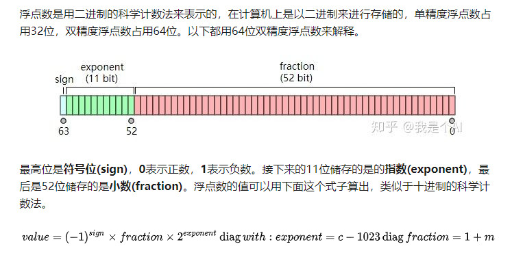

# 零 基础知识
## 0 单词
<table>
    <tr>
        <td>property</td>
        <td>特性</td>
    </tr>
    <tr>
        <td>extension</td>
        <td>扩展</td>
    </tr>
    <tr>
        <td>configurable</td>
        <td>可配置的</td>
    </tr>
    <tr>
        <td>writable</td>
        <td>可写的</td>
    </tr>
    <tr>
        <td>enumrable</td>
        <td>可枚举的</td>
    </tr>
    <tr>
        <td>seal</td>
        <td>密封</td>
    </tr>
    <tr>
        <td>exponent</td>
        <td>指数</td>
    </tr>
     <tr>
        <td>fraction</td>
        <td>小数</td>
    </tr>
    <tr>
        <td>epsilon</td>
        <td>希腊字母中表示极小值的那个</td>
    </tr>
</table>

## 1 typeof, instanceof
- typeof只能分辨基本数据类型和object
- instanceof可以用于判断对象类型，即某个对象是不是某个构造对象的实例
## 2 Object.prototype.toString.call(object)
- <font color="red">每个对象</font>都默认有toString方法
- 如果此方法在自定义对象中未被覆盖，toString() 返回 "[object type]"，其中 type 是对象的类型，返回的类型是string类型
- 应用
- 判断对象类型
```javascript
	// 获取strObject的构造函数类型
	var objectType = Object.prototype.toString.call(strObject);
	console.log(objectType.substring(8, objectType.length - 1));
```
## 3 理解这段话
- 有些函数具有 this 引用，有时候这些 this 确实会指向调用位置的对象引用。但是这种用法从本质上来说并没有把一个函数变成一个“方法”，因为 this 是在运行时根据调用位置动态绑定的，所以函数和对象的关系最多也只能说是间接关系。
- 函数并不是在定义时成为方法，而是在被调用时根据调用位置的不同成为方法（不太准确但可以作为理解）
- 即使你在对象的文字形式中声明一个函数表达式，这个函数也不会“属于”这个对象——它们只是对于相同函数对象的多个引用
- 结论
    - 函数是某个对象的方法并不是在定义时决定的，而是在调用时确定的（隐式绑定的时候）
## 4 Object的一些常用函数
### 4.1 Object.prototype.toString
- <font color="red">每个对象</font>都默认有toString方法
- 如果此方法在自定义对象中未被覆盖，toString() 返回 "[object type]"，其中 type 是对象的类型，返回的类型是string类型
- 应用
- 判断对象类型
```javascript
	// 获取strObject的构造函数类型
	var objectType = Object.prototype.toString.call(strObject);
	console.log(objectType.substring(8, objectType.length - 1));
```
### 4.2 Object.keys(obj)
- ES6新增的方法
```javascript
    Object.keys(obj)
```
- 参数
    - obj: 要返回其枚举自身属性的对象
- 返回值
    - 一个表示给定对象的所有可枚举属性的字符串数组
### 4.3 Object.assign()
```javascript
    Object.assign(target, ...sources)
```
- 参数
    - target: 目标对象
    - soures：源对象
- 返回值
    - 目标对象
- 浅拷贝
    - bject.assign()拷贝的是（可枚举）属性值。假如源值是一个对象的引用，它仅仅会复制其引用值。
```javascript
    const newObj = Object.assign({}, oldObj);
```
## 5 浮点数双精度的科学计数法
- 浮点数是用二进制的科学计数法来表示，由于js采用的是双精度的浮点数，以下就以双精度浮点数及64位二进制数来说明
- <font color=red>双精度浮点数的10进制的精确有效位</font>
    - 所以只能保证前15位是精确数字，第16位只是部分精确。
        - 大于等于5：不精确，会被舍弃掉
        - 小于5：精确，保留
- 
- sign(63): 符号位
- exponent(52~62): 指数位
    - 取值范围
        - 原本表示的区间为[0, 2047]
        - 计算最后结果时结果的区间[0-1023, 2047 - 1023]
            - 去掉c = 0且c为最大值: [-1022, 1023]
    - 为什么要计算最后结果时减去指数偏移量
        - 为了使得改指数形式可以表示出负数
    - 为什么减去的偏移量为1023
        - 使得最高为可以类似表示为符号位
- fraction(0~51):小数点后的尾数
    - 由于是小数部分，所以2的平方根
    - 取值范围:
        - 原本表示的区间：
            - $$ [ 0, 1- 2^{-52} ]$$
        - 计算结果表示的范围
            - $$ [ 1, 2- 2^{-52} ]$$
    - 为什么在计算最后的小数部分的时候结果要加1
        - 在使用二进制科学计算法表示该数时，要保证二进制形式的小数的整数部分为1，所以实际上fraction表示的只是尾数部分
- 表示正数最大值：
    - $$ exponent=2046，fraction=1 - 2^{-52} $$ 
    - 用10进制表示约为
        - $$ 2 \times 10^{308} $$
- 表示正数最小值
    - $$ exponent=1，fraction= 0$$
    - 用10进制表示约为
        - $$ 2 \times 10^{-308} $$ 
- 当exponent=0和exponent=2047的特殊含义
<table>
    <thead>
        <tr>
            <th>exponent</th>
            <th>fraction</th>
            <th>result</th>
        </tr>
    </thead>
    <tbody>
        <tr>
            <td>=0</td>
            <td>=0</td>
            <td>(+/-)0</td>
        </tr>
        <tr>
            <td>=0</td>
            <td>!=0</td>
            <td>denormalized number 非规格化数</td>
        </tr>
        <tr>
            <td>=2047</td>
            <td>=0</td>
            <td>(+/-)无穷</td>
        </tr>
        <tr>
            <td>=2047</td>
            <td>=0</td>
            <td>NAN</td>
        </tr>
    <tbody>
</table> 

### 5.1 将浮点数转化为二进制科学计数法遇到的问题
- 一些小数的尾数部分无法使用小数的二进制进行表示，只能近似的进行表示
- 规格化成浮点数的步骤：
    - 将整数部分和小数部分分别格式化成二进制数
    - 整数部分只保留1
    - 根据计算公式求得对应的exponent和fraction
```javascript   
    类型1：
    10.25
    第一步：用二进制形式表示
    // 小数部分可以用有限的二进制数表示
    1010.01
    第二步：整数部分只保留1
    1.01001 * 2 ^ 3;
    第三步：根据公式计算
    exponent = 3 + 1023 = 1026
    fraction = 01001

    类型2：
    10.4
    第一步：用二进制形式表示
    // 小数部分无法使用有限的二进制数表示，则要用近似的表示方法，二进制至少要保留52位
    1010.01100 01100 ...(保留52位)
    第二步：整数部分只保留1
    1.010 01100 01100 ...(保留52位) * 2 ^ 3
    第三步：根据公式计算
    exponent = 3 + 1023 = 1026
    fraction = 010 01100 01100 ...(保留52位)
```
- 由于有些小数并不能用一一对应的二进制形式表示，所以会导致这些小数在表达式的计算中会出现误差，该误差的数量级为
    - $$ 2^{-52} = 2.2 \times 10^{-16}$$
    - 导致10进制小数只能保证15位有效数字，第16位就开使为部分精确
### 5.2 常见的解释原因问题
```javascript
例1：
>>> 1.4 - 1.1
0.2999999999999998
为什么不是0.3？
/*
1.4和1.1两个数都不能被精确表示，用[4]的链接可以将浮点数字面量转换成真实存储的值，可以看到1.4被近似成了1.399999999999999，1.1被近似成了1.10000000000000008所以两数相减得到的不是0.3而是0.2999999999999998。
*/
例2：
4.0 + 1e+16 - 1e+16
>>> 4.0
没错。
5.0 + 1e+16 - 1e+16
>>> 4.0
为什么5变成了4？
/*
所以在例2中 ，恰巧第16位有效数字是部分精确的，4可以被精确表示，因为最后一位并不能表示5，所以出现了浮点数误差。
*/
4.0 + 1e+17 - 1e+17
>>> 0.0
为什么结果是0.0？ 4去哪了？
/*
4已经在第17位，超出了双精度浮点数的最大有效位数，就被忽略了，所以有[公式] 。
*/
```

## 6 一些js的简单表示
- Object.prototype.func ==> Object#func


# 一 作用域
## 1 js引擎进行编译过程（在执行前）
- js引擎： 可以根据需要创建并存储变量
- 词法分析(Tokenizing/Lexing)
    - 将由字符组成的字符串分解成有意义的代码块
- 语法分析
- 代码生成
    - 将var a = 2;的AST转化为一组机器指令，用来创建一个叫做a的变量（包括分配内存等），并将一个值存储在a中
## 2 理解作用域
### 2.1 认识三个对话的部分
- 引擎
    - 从头到尾负责整个js程序的编译及执行过程
- 编译器
    - 负责语法分析即代码生成等等
- 作用域
    - 负责收集并维护所有声明的表示符组成的一系列查询，并实施一套非常严格的规则，确定当前执行的代码对这些标识符的访问权限
### 2.2 对话的过程
- 
### 2.3 js引擎查询变量的方法
- LHS查询
    - 查询变量是否已经声明后并给它赋值
- RHS查询
    - 变量已经赋值，查询变量的值

```javascript 
    function foo(a) {
        console.log(a)
    }

    foo(2);
    // a = 2 为LHS查询
    // console.log(a) 为RHS查询
```

- 练习
    - 引擎和作用域的对话
``` javascript
    function foo(a) {

    }
    var c = foo(2)
    /**
    * 三次LHS查询
    *   1 调用函数时，a需要进行LHS引用
    *   2 b需要进行LHS引用
    *   3 c需要进行LHS引用
    * 四次RHS查询
    *   1 调用foo函数：js引擎询问在该作用域当中有没有foo函数
    *   2 赋值b时，js询问a的值
    *   3 在return时，询问a,b的值
    *   4 赋值c时，js询问函数的返回值
    */
```

- 认清语法LHS和RHS的重要性
```javascript
    function foo(a) {
        console.log(a + b);
        b = a;
    }

    foo(2)
    /*
    *   b是一个未声明的变量，所以进行RHS查询时无法找到，是一个undefined类型，抛出ReferenceError
    *                        若RHS查询对变量进行不符合规范的引用，如变量不是函数全被调用成函数, 抛出TypeError
    *   对b进行LHS查询，由于b没有声明，若在非严格模式下，js引擎会自动帮你创建一个全局变量
    *                                  若严格模式下, js引擎会抛出ReferenceError
    */
```

### 2.3 作用域嵌套
- 当一个块或函数嵌套在另一个块或函数中时，就发生了作用域的嵌套。
    - 以{}符号作为一个块
- 遍历作用域链的过程
    - 在当前作用域中无法找到某个变量时，引擎就会在外层嵌套的作用域中继续查找，直到找到该变量，或抵达最外层的作用域（也就是全局作用域）为止
### 2.4 总结
- 作用域是一套规则，用于确定在何处以及如何查找变量（标识符）
- 如果查找的目的是对变量进行赋值，那么就会使用 LHS 查询；如果目的是获取变量的值，就会使用 RHS 查询。
- JavaScript 引擎首先会在代码执行前对其进行编译，在这个过程中，像 var a = 2 这样的声明会被分解成两个独立的步骤：
    - 首先，var a 在其作用域中声明新变量。这会在最开始的阶段，也就是代码执行前进行。
    - 接下来，a = 2 会查询（LHS 查询）变量 a 并对其进行赋值。
- 遍历作用域链
    - LHS 和 RHS 查询都会在当前执行作用域中开始，如果有需要（也就是说它们没有找到所需的标识符），就会向上级作用域继续查找目标标识符，这样每次上升一级作用域（一层楼），最后抵达全局作用域（顶层），无论找到或没找到都将停止。
- 异常抛出
    - 不成功的 RHS 引用会导致抛出 ReferenceError 异常。（没有进行声明）
    - 不成功的 LHS 引用会导致自动隐式地创建一个全局变量（非严格模式下），该变量使用 LHS 引用的目标作为标识符，或者抛出 ReferenceError 异常（严格模式下）。
## 3 理解词法作用域
- 词法作用域是一种静态作用域，即某个变量在声明的时候就已经确定了其作用域范围，该变量的作用域即是该变量的词法作用域
### 3.1 欺骗词法
#### 3.1.1 eval()
```javascript
    function foo(str, a) {
        eval(str); // 欺骗
        console.log(a, b);
    }
    var b = 2;
    foo("var b = 3;", 1) // 1, 3
    // 当 console.log(..) 被执行时，会在 foo(..) 的内部同时找到 a 和 b，但是永远也无法找到外部的 b
```
- 默认情况下，如果 eval(..) 中所执行的代码包含有一个或多个声（无论是变量还是函数），就会对 eval(..) 所处的词法作用域进行修改。
- 严格模式下,eval(..) 在运行时有其自己的词法作用域，意味着其中的声明无法修改所在的作用域。
```javascript
    function foo(str) {
        "use strict"
        eval(str)
        console.log(a);
    }
    foo("var a = 2");
    // ReferenceError: a is not defined
```
### 3.2 总结
- 词法作用域意味着作用域是由书写代码时函数声明的位置来决定的。编译的词法分析阶段基本能够知道全部标识符在哪里以及是如何声明的，从而能够预测在执行过程中如何对它们进行查找。
## 4 函数作用域
- 函数作用域的含义是指，属于这个函数的全部变量都可以在整个函数范围内使用及复用
```javascript
    function foo(a) {
        var b = 2;

        function bar() {
            // ...
        }
        var c = 3;
    }
    // 全局作用域气泡：foo
    // foo函数作用域气泡：a, b, bar, c
    // 所以全局无法访问a, b, bar, c
```
### 4.1 隐藏内部实现
```javascript
    function doSomething(a) {
        b = a + doSomethingElse(a * 2);
        console.log(b * 3);
    }
    function doSomethingElse(a) { 
        return a - 1;
    }

    var b;
    doSomething(2);
    // 在这个代码片段中，变量 b 和函数 doSomethingElse(..) 应该是 doSomething(..) 内部具体实现的“私有”内容
    // 所以应该是隐藏在内部
```
### 4.2 规避冲突
```javascript
    function foo() {
        function bar(a) {
            i = 3;
            console.log(a + i);
        }

        for(var i = 0;i < 10;i ++) {
            bar(i * 2);
        }
    }
    // 会陷入无限的循环
    // bar(..) 内部的赋值表达式 i = 3 意外地覆盖了声明在 foo(..) 内部 for 循环中的 i
    // 解决方法：内部声明一个i变量或者其他变量
```
### 4.3 全局命名空间
- 声明一个对象，在对象内部声明变量和函数，该对象就被称为命名空间
### 4.4 匿名和具名
- 区分函数表达式和函数声明
    - 函数的声明必须用具名函数
    - 有LRS的引用就可以称之为函数表达式，此时可以用匿名函数或者具名函数
```javascript
    // 赋值表达式
    const a = function() {
        // ...
    }
    // 函数的参数
    function foo(def) {
        def();
    }
    foo(function() {
        // ...
    })
    // 立即执行函数表达式
    (function(args){
        // ...
    })(args)
    (function(args) {
        // ...
    }(args))
```
### 4.4 立即执行函数表达式
- IIFE(Immediately Invoked Function Expression)
```javascript
// 法1
    (function(args){
        // ...
    })(args)
// 法2
    (function(args) {
        // ...
    }(args))
```
## 5 块作用域
### 5.1 var声明的变量不具有块级作用域
- 在用var声明变量的时候，var并不具有块级作用域
```javascript
    {
        var a = 10;
    }
    console.log(a);
    // 10
    // 函数及作用域
    function foo() {
        var a = 10;
    }
    console.log(a);
    // undefined referenceError
```
### 5.2 try...catch的err具有块级作用域
```javascript
    try{
        // ...
    }
    catch(err) {
        console.log(err)
    }
    console.log(err);
    // undefined referenceError
```
### 5.3 let/const声明的变量具有块级作用域
- let/const具有块级作用域
- 使用 let 进行的声明不会在块作用域中进行提升。声明的代码被运行之前，声明并不“存在”
#### 5.3.1 在if语句中
```javascript
    var foo = true;
    if(foo) {
        let bar = foo * 2;
        console.log(bar);
    }
    console.log(bar);
    // 2
    // undefined referenceError
```
#### 5.3.2 垃圾回收中
#### 5.3.3 let循环
- for 循环头部的 let 不仅将 i 绑定到了 for 循环的块中，事实上它将其重新绑定到了循环的每一个迭代中，确保使用上一个循环迭代结束时的值重新进行赋值。
```javascript
    for(let i = 0;i < 10;i ++) {
        console.log(i);
    }
    console.log(i) 
    // undefined referenceError
```
- for循环的转化理解
```javascript
    {
        let j;
        for(j = 0;j < 10;j ++) {
            let i = j;
            console.log(i);
        }
    }
```
### 5.4 总结
- 函数是 JavaScript 中最常见的作用域单元。本质上，声明在一个函数内部的变量或函数会在所处的作用域中“隐藏”起来，这是有意为之的良好软件的设计原则。
- 块作用域指的是变量和函数不仅可以属于所处的作用域，也可以属于某个代码块（通常指 { .. } 内部）。
-  ES3 开始，try/catch 结构在 catch 分句中具有块作用域。
- 在 ES6 中引入了 let 关键字（var 关键字的表亲），用来在任意代码块中声明变量。if(..) { let a = 2; } 会声明一个劫持了 if 的 { .. } 块的变量，并且将变量添加到这个块中。
## 6 提升
- 任何声明在某个作用域内的变量，都将附属于这个作用域。
- 包括变量和函数在内的所有声明都会在任何代码被执行前首先被处理。
### 6.1 编译器对代码的处理
- 包括变量和函数在内的所有声明都会在任何代码被执行前首先被处理。
- 后面按照执行代码的先后来执行;
```javascript
    var a = 2;
    // 实际上执行的过程
    var a; // 声明阶段
    a = 2; // 执行阶段
```
- 练习
```javascript
// 练习一
    a = 2;
    var a;
    console.log(a);

    // 等价于:
    var a;
    a = 2;
    console.log(a);
    // 2
```
```javascript
// 练习二
    console.log(a);
    var a = 2;
    // 等价于
    var a;
    console.log(a);
    a = 2;
    // undefine;
    // 2
``` 
### 6.2 提升
- <font color="red">当执行的变量在代码执行的时候还没有被声明时,要想到变量提升</font>
- 无论作用域中的声明出现在什么地方，都将在代码本身被执行前首先进行处理。
- 将这个过程形象地想象成所有的声明（变量和函数）都会被“移动”到各自作用域的最顶端，这个过程被称为提升
```javascript
    foo();
    function foo() {
        console.log( a );
        var a = 2;
    }
    // 等价于
    function foo() {
        var a;
        console.log( a );
        a = 2;
    }
    foo();
    // undefined;
```
- 注意
    - 只有声明本身会被提升，而赋值或其他运行逻辑会留在原地。
    - 只有函数声明会被提升,函数表达式无法进行提升, 包含具名表达式也无法进行提升
```javascript
    foo();
    var foo = function() {
        // ...
    }
    // TypeError 
    // 等价于
    var foo;
    foo();
    foo = function() {
        // ...
    }
```
```javascript
    foo();
    bar(); 
    var foo = function bar() {
        // ...
    }
    // TypeError 
    // ReferenceError 没有声明bar()
```
### 6.3 避免重复声明
- 变量和函数声明同时提升时, 函数声明优先
```javascript
    foo();
    var foo = 2;
    function foo() {
        console.log(1);
    }
// 2
```
- 一个普通块内部的函数声明通常会被提升到所在作用域的顶部
```javascript
    foo();
    var a = true;
    if(a) {
        function foo() {
            console.log( "a" );
        }
    }
    else{
        function foo() {
            console.log( "b" );
        }
    }
    // b
```
### 6.4 总结
- 我们习惯将 var a = 2; 看作一个声明，而实际上 JavaScript 引擎并不这么认为。它将 var a和 a = 2 当作两个单独的声明，第一个是编译阶段的任务，而第二个则是执行阶段的任务。
- 无论作用域中的声明出现在什么地方，都将在代码本身被执行前首先进行处理。可以将这个过程形象地想象成所有的声明（变量和函数）都会被“移动”到各自作用域的最顶端，这个过程被称为提升。
- 声明本身会被提升，而包括函数表达式的赋值在内的赋值操作并不会提升
- 要注意避免重复声明，特别是当普通的 var 声明和函数声明混合在一起的时候，否则会引起很多危险的问题！

## 7 作用域的闭包
- 某个函数在其他作用域(不是本身的词法作用域)被调用时,仍然可以访问其词法作用域内的变量,即仍然可以引用其所在的词法作用域,该词法作用域就称为闭包.
### 7.1 理解闭包
```javascript
    function foo() {
        var a = 2;
        function bar() {
            console.log( a );
        }
        bar();
    }

    foo();
```
- 由于bar在foo作用域中被执行,不存在闭包的效果
```javascript
    function foo() {
        var a = 2;
        function bar() {
            console.log( a );
        }
        return bar;
    }

    var baz = foo();
    baz();
```
- 由于bar在foo中定义,即bar是foo的作用域气泡,即bar正常情况下只能在foo的作用域范围内被执行
- 但是,在该例子中bar在自己定义的词法作用域以外的地方执行。
    - 原因: 由于闭包的原因,bar仍然可以访问它定义时的作用域
### 7.2 闭包的实质
-  foo() 执行后，通常会期待 foo() 的整个内部作用域都被销毁, 但闭包阻止了该内部作用域被销毁, 即该作用域仍然被bar所使用, 即bar() 依然持有对该作用域的引用，而这个引用就叫作闭包。
### 7.3 闭包的通常形式
- 通过return返回对应的函数
```javascript
    function foo() {
        var a = 2;
        function bar() {
            console.log( a );
        }
        return bar;
    }

    var baz = foo();
    baz();    
    // 2
```
- 通过参数传递的形式
```javascript
function foo() {
    var a = 2;
    function bar() {
        console.log( a );
    }
    baz(bar);
}
function baz(fn) {
    fn();
}
foo();
// 2
// bar在baz函数作用域执行,仍然调用其词法作用域的内容
function wait(args) {
    setTimeout(function timer() {
    // ...有用到args
    }, 1000)
}
// 在其他作用域调用了timer函数,但仍然可以访问到args
```
- 通过外部变量传递
```javascript
var baz;
function foo() {
    var a = 2;
    function bar() {
        console.log( a );
    }
    baz = bar;
}
foo();
baz();
// 2
// bar在全局作用域执行,仍然调用其词法作用域的内容
```
### 7.3 闭包的运用
#### 7.3.1 循环和闭包
```javascript
    for(var i = 0;i <= 5;i ++) {
        setTimeout(function() {
            console.log(i);
        }, 1000)
    }
//  6 6 6 6 6 6
```
- 原因:在执行完同步代码之后,此时的i为6,而异步执行的setTimeout的回调函数满足条件后被调用时,显然是输出6
- 解决方法
    - 法1: 运用立即函数作用域的闭包给每个循环创建一个新的作用域
    - 法2: 利用块级作用域
```javascript
    for(var i = 0;i <= 5;i ++) {
        (function() {
            var j = i;
            setTimeout(function() {
            console.log(j);
            }, 1000)
        })()
    }
```
```javascript
    for(var i = 0;i <= 5;i ++) {
        (function(j) {
            setTimeout(function() {
            console.log(j);
            }, 1000)
        })(i)
    }
``` 
```javascript
    for(let i = 0;i <= 5;i ++) {
        setTimeout(function() {
            console.log(i);
        }, 1000)
    }
```
#### 7.3.2 实现模块
- 必须有<font color="red">外部的封闭函数</font>，该函数必须至少被调用一次（每次调用都会建一个新的模块实例）。
- 封闭函数必须返回至少一个内部函数，这样内部函数才能在私有作用域中形成闭包，并且可以访问或者修改私有的状态。
- 模块的基本形式
```javascript   
    function foo() {
        var something = "cool";
        var another = [1, 2, 3];
        function doSomething() {
            console.log(something);
        }
        function doAnother() {
            console.log(another);
        }
        return {
            doSomething: doSomething,
            doAnother: doAnother
        }
    }

    var CoolModule = foo();
    CoolModule.doSomething();
    CoolModule.doAnther();
```
- doSomething() 和 doAnother() 函数具有涵盖模块实例内部作用域的闭包
- IIFE模块
```javascript
    var args = undefined;
    var module1 = (function(args) {
        var something = "cool";
        var another = [1, 2, 3];
        function doSomething() {
            console.log(something);
        }
        function doAnother() {
            console.log(another);
        }
        return {
            doSomething: doSomething,
            doAnother: doAnother
        }
    })(args)
    module1.doSomething();
    module1.doAnother();
```
### 7.4 总结
- 当函数可以记住并访问所在的词法作用域，即使函数是在当前词法作用域之外执行，这时就产生了闭包。
- 模块有两个主要特征：
    - （1）为创建内部作用域而调用了一个包装函数；
    - （2）包装函数的返回值必须至少包括一个对内部函数的引用，这样就会创建涵盖整个包装函数内部作用域的闭包。
# 二 this和对象原型
## 1 this的理解
- this是在运行时进行绑定,而不是编写时绑定,它的上下文取决于函数调用时的各种条件.
- this的绑定和函数声明的位置没有任何关系,只取决于函数的调用方式
### 1.1 this的实质
- 当一个函数被调用时,会创建一个活动记录(有时候被称为执行上下文).这个记录会包含在玛丽被调用(调用栈),函数的调用方法,传入的参数等信息.this就是记录其中一个属性,会在函数执行的过程中用到.
### 1.2 this的全面解析
#### 1.2.1 寻找调用位置和调用栈
- 调用位置:函数在代码中被调用的位置
```javascript
    function baz() {
        /*
         * 第二步
         * 当前的调用栈是:baz
         * 当前的调用位置是全局作用域
        */
        console.log("baz");
        bar(); // 第三步: bar的调用位置
    }
    function bar() {
        /*
         * 第四步
         * 当前的调用栈是:baz -> bar
         * 当前的调用位置是baz中
        */
        console.log("bar");
        foo(); // 第五步: foo的调用位置
    }
    function foo() {
        /*
         * 第六步
         * 当前的调用栈是:baz -> bar -> foo
         * 当前的调用位置是bar中
        */
        console.log("foo");
    }

    baz();  // 第一步:baz的调用位置
```
- 调用栈的倒数第二个即为调用位置
#### 1.2.2 this的绑定规则
##### 1.2.2.1 默认绑定
- 默认this指向全局对象(window)
- 常见于独立函数的调用
    - 直接使用不带任何修饰的函数引用进行调用的，因此只能使用默认绑定
```javascript
    function foo() {
        console.log(this.a);
    }
    var a = 2;
    foo();

    // 2
```
- 注意
    - 在严格模式下,this是没有指向全局对象的,而是绑定到undefined
```javascript
    function foo() {
        "use strict";
        console.log(this.a);
    }
    var a = 2;
    foo();
    // TypeError: this is undefined
```
##### 1.2.2.2 隐式绑定
- 是<font color="red">调用位置</font>是否有上下文对象，或者说是否被某个对象拥有或者包含，隐式绑定规则会把函数调用中的 this 绑定到这个上下文对象
- 指向调用的对象
```javascript
    function foo() {
        console.log(this.a);
    }
    var obj2 = {
        a: 42,
        foo: foo
    }
    var obj1 = {
        a:2,
        obj2:obj2
    }
    obj1.obj2.foo() 
    // 42
```
###### 1.2.2.2.1 隐式丢失
- 使用函数别名进行调用
    - 虽然 bar 是 obj.foo 的一个引用，但是实际上，它引用的是 foo 函数本身，因此此时的bar() 其实是一个不带任何修饰的函数调用，因此应用了默认绑定。
```javascript
// 相当于这种形式
    function foo() {
        console.log(this === window);
        console.log(this.a);
    }
    var obj1 = {
        a: 2,
        foo: foo
    }
    var a = "hello world"
    var bar = obj1.foo;
    bar();
    //true "hello world"
```
```javascript
    var obj1 = {
        a: 2,
        foo: function() {
            console.log(this === window);
            console.log(this.a);
        }
    }
    var a = "hello world"
    var bar = obj1.foo;
    bar();
    //true "hello world"
```
- 传入回调函数的参数
    - 参数传递其实就是一种隐式赋值，因此我们传入函数时也会被隐式赋值，与上面的结果一样
```javascript
    function foo() {
        console.log(this === window);
        console.log(this.a);
    }
    var obj1 = {
        a: 2,
        foo: foo
    }
    function doFunc(fn) {
        fn();
    }
    var a = "hello world"
    doFunc(obj1.foo);
    //true "hello world"
    // setTimeout的回调函数也有类似的作用
```
##### 1.2.2.3 显示绑定
- 使用call, apply进行显示调用
- 使用bind进行硬绑定
    - 使得obj1中的this指向foo的this,
        - 若foo中有this的属性,方法,则都变成了obj1的方法
        - foo的this是obj1的this
    - 解决使用函数别名进行调用
```javascript
    function foo() {
        console.log(this === window);
        console.log(this.a);
    }
    var obj1 = {
        a: 2,
        foo: foo
    }
    var a = "hello world"
    var bar = foo.bind(obj1);
    bar();
    // false 2
```
- API调用的上下文
    - 第三方库的许多函数，以及 JavaScript 语言和宿主环境中许多新的内置函数，都提供了一个可选的参数，通常被称为“上下文”（context），其作用和 bind(..) 一样，确保你的回调函数使用指定的 this
```javascript
    var obj = {
        id: "awesome"
    };
    [1, 2, 3].forEach( function(el) {
        console.log( el, this.id );
    }, obj );
    /*
    1 awesome
    2 awesome
    3 awesome
    */
```
##### 1.2.2.4 new绑定
- 四步走
    - 创建一个新的对象
    - 这个新对象会执行原型连接
    - 这个新对象会绑定到函数调用的this
    - 如果函数没有返回其他对象,那么new表达式中的函数调用会自动返回这个新对象
#### 1.2.3 this的绑定规则判断
- 函数是否在 new 中调用（new 绑定）？如果是的话 this 绑定的是新创建的对象。
    - var bar = new foo()
- 函数是否通过 call、apply（显式绑定）或者硬绑定调用？如果是的话，this 绑定的是指定的对象。
    - var bar = foo.call(obj2)
- 函数是否在某个上下文对象中调用（隐式绑定）？如果是的话，this 绑定的是那个上下文对象。
    - var bar = obj1.foo()
- 如果都不是的话，使用默认绑定。如果在严格模式下，就绑定到 undefined，否则绑定到全局对象。
    - var bar = foo()
#### 1.2.4 this的绑定例外
##### 1.2.4.1 被忽略的this
- 如果你把 null 或者 undefined 作为 this 的绑定对象传入 call、apply 或者 bind，这些值在调用时会被忽略，实际应用的是默认绑定规则
- 在使用call,apply,bind有时候只需要运用传输参数,此时的this应该指向一个空的对象,使用以下的方法更加安全
    - 创建一个“DMZ”（demilitarized-zone，非军事区）对象——它就是一个空的非委托的对象
```javascript
    function foo(a,b) {
        console.log( "a:" + a + ", b:" + b );
    }
    var ø = Object.create(null);
    // 把数组展开成参数
    foo.apply( ø, [2, 3] ); // a:2, b:3
    // 使用 bind(..) 进行柯里化
    var bar = foo.bind( ø, 2 );
    ar( 3 );   
```
##### 1.2.4.2 间接引用
- 创建一个函数的“间接引用”，在这种情况下，调用这个函数会应用默认绑定规则。
```javascript
    function foo() {
        console.log(this.a);
    }
    var a = 2;
    var o = {
        a: 3,
        foo: foo
    }
    var p = {
        a: 4
    }
    o.foo()
    (p.foo = o.foo) ()
    // 间接引用是默认绑定
    // 3
    // 2
```
##### 1.2.4.2 软绑定
- 硬绑定会大大降低函数的灵活性，使用硬绑定之后就无法使用隐式绑定或者显式绑定来修改 this
- 可以给默认绑定指定一个全局对象和 undefined 以外的值，那就可以实现和硬绑定相同的效果，同时保留隐式绑定或者显式绑定修改 this 的能力。
- softBind(..) 
    - 会对指定的函数进行封装，首先检查调用时的 this，<font color="red">如果 this 绑定到全局对象或者 undefined，那就把指定的默认对象 obj 绑定到 this，否则不会修改 this</font>。
```javascript
    function foo() {
        console.log("name: " + this.name);
    }
    var obj = { name: "obj" },
    obj2 = { name: "obj2" },
    obj3 = { name: "obj3" };
    var fooOBJ = foo.softBind( obj );
    fooOBJ(); // name: obj
    obj2.foo = foo.softBind(obj);
    // 此时为默认绑定
    obj2.foo(); // name: obj2 <---- 看！！！
    fooOBJ.call( obj3 ); // name: obj3 <---- 看！
    setTimeout( obj2.foo, 10 );
    // name: obj <---- 应用了软绑定
```
##### 1.2.4.3 箭头函数
- 箭头函数会继承外层函数调用的 this 绑定（无论 this 绑定到什么）
##### 1.3 总结
- 如果要判断一个运行中函数的 this 绑定，就需要找到这个函数的直接调用位置,然后再运用规则
- this的规则
1. 由 new 调用？绑定到新创建的对象。
2. 由 call 或者 apply（或者 bind）调用？绑定到指定的对象。
3. 由上下文对象调用？绑定到那个上下文对象。
4. 默认：在严格模式下绑定到 undefined，否则绑定到全局对象。
- 一定要注意，有些调用可能在无意中使用默认绑定规则。如果想“更安全”地忽略 this 绑定，你可以使用一个 DMZ 对象，比如 ø = Object.create(null)，以保护全局对象。
- ES6 中的箭头函数并不会使用四条标准的绑定规则，而是根据当前的词法作用域来决定this，具体来说，箭头函数会继承外层函数调用的 this 绑定（无论 this 绑定到什么）
# 三 对象
## 1 对象的定义形式
- 声明/文字形式
    - 添加多个键值对
- 构造形式
    - 逐个添加属性
```javascript
    // 文字形式
    var obj = {
        // ...
    }
    // 构造形式
    var obj = new Object();
    myObj.key = value;
```
## 2 js的类型问题
### 2.1 六种主要类型
- typeof只能分辨简单基本类型和对象。
- instanceof表示是某个人的实例。
#### 2.1.1 简单基本类型
    - string
    - number
    - boolean
    - null
    - undefined
#### 2.1.2 复杂基本类型（object)
- 特殊对象的子类型
- 内置对象
    - String
    - Number
    - Boolean
    - Object
    - Function
    - Array
    - Date
    - RegExp
    - Error
##### 2.1.2.1 区分String, Number, Boolean和简单基本类型的关系
- 理解
    - 原始值"hello world"是一个字面量，是一个固定的值
        - 如果要在这个字面量上执行一些操作，比如获取长度、访问其中某个字符等，那需要将其转换为 String 对象，
        - 在必要时语言会自动把字符串字面量转换成一个 String 对象，也就是说你并不需要显式创建一个对象。
- 区别
```javascript 
    var str = "hello world";
    console.log(typeof str);
    console.log(str instanceof String);
    /*
    *   string
    *   false
    */

    var strObject = new String("hello world");
    console.log(typeof strObject);
    console.log(strObject instanceof String);
    /*
    *   object
    *   true
    */

    // 获取strObject的构造函数类型
    var objectType = Object.prototype.toString.call(strObject);
    console.log(objectType.substring(8, objectType.length - 1));
    // String
```
- 字面量的转化
    - js引擎会自动将字面量转化为对应的对象类型再调用其对应的 方法
        - 即转化为new String/Number/Boolean(var)
```javascript
    var str = "hello world";
    console.log(str.length);
    console.log(str.charAt(3))
    // 11 "l"
    42.359.toFixed(2) 
```
## 3 对象的访问问题
- 在对象中，<font color="red">属性名永远都是字符串</font>。如果你使用 string（字面量）以外的其他值作为属性名，那<font color="red">它首先会被转换为一个字符串</font>,即使是数字也不例外
### 3.1 属性访问
- 只能使用对应的属性值才能进行访问
- 若不是访问而是赋值
    - 可以用于添加新的属性和值（必须有两者）
```javascript
    var myObject - {
        a: 2
    }
    console.log(myObject.a)
```
### 3.2 键值访问
- 要求键值的规范
    - 而 [".."] 语法可以接受任意 UTF-8/Unicode 字符串作为属性名
    - 可以使用字符串的变量来进行访问
    - ES6增加了可计算属性名，即可以使用表达式来作为[]内的字符串
- 若不是访问而是赋值
    - 可以用于添加新的属性和值（必须有两者）
```javascript
    var myObject - {
        a: 2
    }
    console.log(myObject["a"])
```
### 3.3 对象访问的默认操作
#### 3.3.1 [[Get]]
- myObject.a 在 myObject 上实际上是实现了 [[Get]] 操作
    - 对象默认的内置 [[Get]] 操作首先在当前对象中查找是否有名称相同的属性，如果找到就会返回这个属性的值。
    - 如果没有找到遍历可能存在的 [[Prototype]] 链，也就是原型链
    - 还是没有找到，放回undefined
- 这种方法和访问变量时是不一样的。如果你引用了一个当前词法作用域中不存在的变量，并不会像对象属性一样返回 undefined，而是会抛出一个 ReferenceError 异常：
#### 3.3.2 [[Put]]
- [[Put]] 算法大致会检查下面这些内容。
1. 属性是否是访问描述符（参见 3.3.9 节）？如果是并且存在 setter 就调用 setter。
2. 属性的数据描述符中 writable 是否是 false ？如果是，在非严格模式下静默失败，在严格模式下抛出 TypeError 异常。
3. 如果都不是，将该值设置为属性的值。
#### 3.3.3 如何判断是否具有某个属性
##### 3.3.3.1 通常情况（不存在对应值为undefined）
```javascript
    obj.a //返回undefined
```
##### 3.3.3.2 特殊情况下
- Object.prototype.hasOwnProperty.call(obj, prop)
- obj.hasOwnProperty(prop)
```javascript   
    obj.hasOwnProperty(prop)
```

- prop in obj
```javascript
    prop in obj
```

- 区别
    - obj.hasOwnProperty(prop)只会检查对象本身是否具有该prop，in会连原型链都检查
## 4 对象的复制
- 对象的存储
    - obj[key]即对应的value
        - 基本类型：存储该值
        - 复杂类型：存储该复杂类型数据所在堆中的地址
### 4.1 浅复制
- 基本数据类型有进行复制
    - Object.assign(target, ...sources)
- 复杂数据类型只是指向对应的堆的地址，没有对其进行赋值
### 4.2 深复制
```javascript
    const newObj = {}
    function deepCopy(oldObj, newObj) {
        Object.keys(oldObj).forEach((key, index) => {
            let value = oldObj[key];
            if(value instanceof Array) {
                newObject[key] = [];
                deepCopy(value, newObject[key]);
            }
            else if(value instanceof Object) {
                newObject[key] = {};
                deepCopy(value, newObject[key]);
            }
            else {
                newObject[key] = value;
            }
        })
    }
```
## 5 对象的属性描述符
- 对象属性对应的值实际上是一个对象
    - value
        - 该属性对应的值。可以是任何有效的 JavaScript 值（数值，对象，函数等）。
        - 默认为undefined
    - 后面三个对应了该属性的一些特性（即属性描述符）
        - writable
            - 当且仅当该属性的 writable 键值为 true 时，属性的值，也就是上面的 value，才能被赋值运算符改变。
            - 默认值为false
        - configurable
            - 当且仅当该属性的 configurable 键值为 true 时，该属性的描述符才能够被改变，同时该属性也能从对应的对象上被删除。
            - 默认值为false
        - enumerable
            - 当且仅当该属性的 enumerable 键值为 true 时，该属性才会出现在对象的枚举属性中。
            - 默认值为false
        - get
            - 属性的 getter 函数。当访问该属性时，会调用此函数。执行时不传入任何参数，但是会传入 this 对象（由于继承关系，这里的this并不一定是定义该属性的对象）。该函数的返回值会被用作属性的值。
            - 默认为undefined
        - set 
            - 属性的 setter 函数。当属性值被修改时，会调用此函数。该方法接受一个参数（也就是被赋予的新值），会传入赋值时的 this 对象。
            - 默认为undefined
- 若在不允许的情况下对相应的属性描述符或者属性值进行修改，则会返回TypeError
```javascript
    {
        value: 2,
        writable: true/false;
        configurable: true/false;
        enumerable: true/false;
        // 在访问该属性时调用
        get() {
            // ...
            return 
        }
        // 在修改该属性时调用
        set() {
            // ...
        }
    }
```
### 5.1 对对象属性特性的操作
#### 5.1.1 Object.defineProperty()
- 给obj添加/修改一个普通的属性并显式指定/修改了一些特性
```javascript
    Object.defineProperty(obj, prop, descriptor)
```
- 参数
    - obj：要定义属性的对象
    - prop: 要定义或修改的属性的名称或 Symbol
    - descriptor: 要定义或修改的属性描述符。(使用对象)
- 返回值
    - 被传递给函数的对象。
```javascript
    var obj = {};
    Object.definePropety(obj, "a", {
        value: 2,
        writable: false,
        configurable: true,
        enumerable: true
    })
```
### 5.2 对象属性的不变性
#### 5.2.1 对象常量
- 将对象属性特性
    - writable: false
    - configurable: false
### 5.3 对象的不变性
#### 5.3.1 Object.preventExtensions(obj)
- 禁止对一个对象增添新的属性并且保存已有的属性
    - Object.preventExtensions()仅阻止添加自身的属性。但其对象类型的原型依然可以添加新的属性。
```javascript
    Object.preventExtensions(obj);
    Object.isExtensions(obj)
    // 判断一个对象是否是不可扩展的对象
```
- 参数
    - obj：将要变得不可扩展的对象。
- 返回值
    - 已经不可扩展的对象。
#### 5.3.2 Object.seal(obj)
- __proto__ (  ) 属性的值也会不能修改。
- Object.preventExtensions(obj) + configurable: false
```javascript
    Object.seal(obj);
```
- 参数
    - obj：将要变得不可扩展的对象。
- 返回值
    - 已经不可扩展的对象。
#### 5.3.3 Object.freeze(obj)
- __proto__ (  ) 属性的值也会不能修改。
- Object.seal(obj) + wriable: false
```javascript
    Object.freeze(obj);
```
- 参数
    - obj：将要变得不可扩展的对象。
- 返回值
    - 已经不可扩展的对象。
### 5.4 不可枚举属性的问题
#### 5.4.1 常见的枚举函数
##### 5.4.1.1 Object.keys(obj)
- 会返回一个数组，包含所有可枚举属性
- 属性只是当前对象的属性，不包含原型链
##### 5.4.1.2 Object.getOwnPropertyNames(obj)
- 会查找对象直接包含的属性(包括不可枚举类型)
- 属性只是当前对象的属性，不包含原型链
##### 5.4.1.3 for...in...(key)
- 可以用来遍历对象的可枚举属性列表（包括 [[Prototype]] 链）
##### 5.4.1.4 for...of...(value)
- 遍历属性的值
- 本质
    - 循环首先会向被访问对象请求一个迭代器对象，然后通过调用迭代器对象的next() 方法来遍历所有返回值
#### 5.4.2 obj.propertyIsEnumerable(prop)
- 会检查给定的属性名是否直接存在于对象中
```javascript
    obj.propertyIsEnumerable(prop);
```
## 6 总结
- JavaScript 中的对象有字面形式（比如 var a = { .. }）和构造形式（比如 var a = new Array(..)）。字面形式更常用
- 对象是 6 个（或者是 7 个，取决于你的观点）基础类型之一。对象有包括 function 在内的子类型，不同子类型具有不同的行为，比如内部标签 [object Array] 表示这是对象的子类型数组。
- 对象就是键 / 值对的集合。可以通过 .propName 或者 ["propName"] 语法来获取属性值。访问属性时，引擎实际上会调用内部的默认 [[sGet]] 操作（在设置属性值时是 [[Put]]），[[Get]] 操作会检查对象本身是否包含这个属性，如果没找到的话还会查找 [[Prototype]]链
- 属性的特性可以通过属性描述符来控制，比如 writable 和 configurable。此外，可以使用Object.preventExtensions(..)、Object.seal(..) 和 Object.freeze(..) 来设置对象（及其属性）的不可变性级别。
- 属性不一定包含值——它们可能是具备 getter/setter 的“访问描述符”。此外，属性可以是可枚举或者不可枚举的，这决定了它们是否会出现在 for..in 循环中。
- 你可以使用 ES6 的 for..of 语法来遍历数据结构（数组、对象，等等）中的值，for..of会寻找内置或者自定义的 @@iterator 对象并调用它的 next() 方法来遍历数据值。
# 四 混合对象“类”
- JavaScript 中实际上没有类，由于类是一种设计模式，所以你可以用一些方法（本章之后会介绍）近似实现类的功能。
- 构造函数
    - 类实例是由一个特殊的类方法构造的，这个方法名通常和类名相同，被称为构造函数
    - 类构造函数属于类，而且通常和类同名，构造函数大多需要用 new 来调
- 类的继承
    - 父类
    - 子类
    - 父母的基因特性会被复制给孩子
    - 子类会包含父类行为的原始副本，但是也可以重写所有继承的行为甚至定义新行为。
- 多态
    - 子类可以重写父类中名字相同的方法，且可以进行调用
    - 在继承链的不同层次中一个方法名可以被多次定义，当调用方法时会自动选择合适的定义
        - 会使用实例化对象的方法
- 混入
# 五 原型
## 0 Object.prototype
- 所有普通的 [[Prototype]] 链最终都会指向内置的 Object.prototype
## 1 Object.create(obj)
- 返回一个新的对象，并且把这个对象的\[\[Prototype\]\]关联到obj
```javascript
    var obj = {
        a: 2
    }
    var newObj = Object.create(obj);

    for(key in newObj) {
        console.log(key)
    }

    console.log("a" in newObj)
    // a true
```
## 2 与prototype链相关的方法
### 2.1 for...in...（key）
- 会遍历当前对象以及其原型链中所有可以可枚举的属性
```javascript
    for(key in obj) {
        // ...
    }
``` 
### 2.2 in
- 会判断某一个属性是否在当前对象以及其原型链的属性
```javascript
    prop in obj
```
## 3 属性设置和屏蔽
### 3.1 属性屏蔽
- 若当前对象myObject有属性prop，其原型链上也有属性prop
    - 在访问属性prop的时候，访问的是myObject上的属性值而不是原型链上的属性
- 此时称该prop为屏蔽属性

### 3.2 属性设置的过程（myObject.prop = value)
- 遍历myObject的属性，
    - 若该属性在myObject在遍历的属性中，则修改myObject的属性值（要考虑是否writable）
    - 若不在myObject的属性，则往其原型链寻找
        - 遍历原型链的属性
            - 若该属性不在原型链上，则向myObject添加该属性以及对应的属性值
            - 若该属性在原型链上
                - 若该属性在原型链上不是只读的类型，则在myObject上添加该属性以及对应的属性值，<font color="red">此时该属性起到了屏蔽的作用</font>
                - 若该属性在原型链上且是只读类型，由于继承的原因，myObject的属性也是只读类型，返回TypeError
                - 如果在原型链上存在该属性并且它是一个 setter。foo 不会被添加到（或者说屏蔽于）myObject，也不会重新定义该属性这个 setter。
- [属性设置的过程](./img/ex2.jpeg)

### 3.3 属性屏蔽和属性设置的易错点--隐式屏蔽
- 在属性值进行++的过程，会有一个属性设置的过程，即给当前对象新增一个属性
```javascript
    var obj = {
        a: 2
    }
    var newObj = Object.create(obj)

    console.log(newObj.a)

    newObj.a ++;
    // newObj.a = newObj.a + 1 相当于一个设置属性的过程
    console.log(obj.a)
    console.log(newObj.a)
    // 2
    // 2
    // 3
```
- 若想要使obj的2增加，必须使用obj.a++
## 4 js的类
- js中并没有所谓的类，只有对象，而是一种类似类的形式
- 所有的函数都会有一个名为prototype的公有并且不可枚举的属性，该属性的值是一个对象，该对象的__proto__属性的值会指向另一个对象
- 所有的对象都具有一个名为__proto__的不可枚举的属性，且该属性指向另一个对象
### 4.1 类的实例对象和类的关系
#### 4.1.1 类的实例的本质
- 若根据类的构造函数创建一个实例时,该实例对象的__proto__会指向该构造函数的prototype
```javascript
    function Foo() {
        // ...
    }

    var obj = new Foo();

    console.log(obj.__proto__ === Foo.prototype)
    console.log(Object.getPrototypeOf(obj) === Foo.prototype)
    // true true
```
#### 4.1.2 原型继承
- 该实例对象的__proto__会指向该构造函数的prototype，这即是原型继承
- 对于js中的类的实例，只是通过原型相互关联，而形成了该类的实例，但本质上是一个对象
#### 4.1.3 类的实例对象的不可枚举属性constructor本质
- 在类/构造函数进行声明的时候，就会有默认的.prototype.constructor的不可枚举属性，该属性指向本身
```javascript
    function Foo() {
        // ...
    }
    console.log(Foo === Foo.prototype.constructor)
    // true
```
- 在通过new创建实例时，由于原型继承，所以实例中的不可枚举属性constructor实际上就是通过Get方法寻找的原型链上的constructor
```javascript
    function Foo() {
        // ...
    }
    Foo.prototype.constructor = {};
    var obj = new Foo();
    console.log(obj.constructor === Foo)
    // false
```
## 5 构造函数的本质
- js中的构造函数实质上是带有new的函数调用，即原本的函数不是构造函数，当且仅当使用new时，函数调用才会变成构造函数的调用
- 调用的时候函数才能称为构造函数

## 6（原型）继承
- Son.prototype
    - 一个只具有__proto__不可枚举属性，且该属性指向Father.prototype的对象
    - 该原型中不具有其他属性
```javascript
    function Father(name) {
        this.name = name;
    }
    Father.prototype.getName = function() {
        return this.name;
    }
    function Son(name, label) {
        this.label = label;
        Father.call(this, name);
    }
    // 此时Son的原型对象的__proto__属性值是指向一个Function.prototype
    Son.prototype = Object.create(Father.prototype)
    // 此时Son因为赋值的原因会丧失掉constructor的不可枚举属性，所以必要时需要重新赋值
    console.dir(Son.prototype)
```
### 6.1 三个常见误区
#### 6.1.1 Son.prototype = Father
- Son的原型对象不是一个函数
#### 6.1.2 Son.prototype = new Father()
- 因为Father实例对象中有对应的this指向的属性，而不是仅仅具有__proto__属性的实例对象，会影响到后代
## 7 instanceof判断的实质（对象与函数）
- 实际上判断的是对象的原型链中是不是有指向函数的原型对象的对象，而不能判断对象与对象之间的关联
```javascript 
    console.log(obj instanceof Father)
    // obj的原型链中是否有指向Fahter.prototype
```
## 8 判断某个对象是否出现在另一个对象的原型链之中
```javascript
    c.isPrototypeOf(b)
    // c对象是否出现在b对象的原型链中

    var obj = {};
    var newObj = Object.create(obj);
    /*
        {
            __proto__: obj
        }
    */
    console.log(obj.isPrototypeOf(newObj))
    // true
```
## 9 获取某个对象的原型链
### 9.1 Object.getPrototypeOf(obj)
- 标准的方法
### 9.2 obj.__proto__
- 在某些浏览器上并不适用
- 对象__proto__的实质：
```javascript
Object.defineProperty( Object.prototype, "__proto__", {
    get: function() {
    return Object.getPrototypeOf( this );
    },
    set: function(o) {
    // ES6 中的 setPrototypeOf(..)
    Object.setPrototypeOf( this, o );
    return o;
    }
    } );
```
## 10 总结
- 如果要访问对象中并不存在的一个属性，[[Get]] 操作（参见第 3 章）就会查找对象内部原型链关联的对象
- 关联两个对象最常用的方法是使用 new 关键词进行函数调用，即使类和实例的关系
# 六 有关类的三种不同设计模式
## 1. 使用构造函数的模式
```javascript
    function Father(name) {
        this.name = name;
    }
    Father.prototype.getName = function() {
        return this.name;
    }

    // 继承
    function Son(name, label) {
        this.label = label;
        Father.call(this, name);
    }
    Son.prototype = Object.create(Father.prototype);
    Son.prototype.getLabel = function() {
        return this.label;
    }
    Son.prototype.printAll = function() {
        console.log(this.getName(), this.label)
    }

    var son = new Son("hello world", 2);
    son.printAll();
    console.log(son.getName());
    console.dir(son);
```
## 2. 使用class模式
```javascript
    class Father {
        constructor(name) {
            this.name = name;
        }
        getName() {
            return this.name;
        }
    }
    class Son extends Father {
        constructor(name, label) {
        	super(name);
        	// super指的是同名的父类函数
            this.label = label;
        }
        getLabel() {
            return this.label;
        }
        printAll() {
            console.log(this.getName(), this.label)
        }
    }
    var son = new Son("hello world", 2);
    son.printAll();
    console.log(son.getName());
    console.dir(son)
```
## 3. 使用事件委派的模式
```javascript
    var Father = {
        fatherInit(name) {
            this.name = name;
        },
        getName() {
            return this.name;
        }
    }
    var Son = Object.create(Father);
    Son.sonInit = function(name, label) {
        this.label = label;
        this.fatherInit(name);
    }
    Son.getLabel = function() {
        return this.label;
    }
    Son.printAll = function() {
        console.log(this.getName(), this.label);
    }
    var son = Object.create(Son);
    son.sonInit("hello world", 2)
    son.printAll();
    console.log(son.getName());
```
```javascript
    var Father = {
        fatherInit(name) {
            this.name = name;
        },
        getName() {
            return this.name;
        }
    }
    var Son = {
        sonInit(name, label) {
            this.label = label;
            this.fatherInit(name);
        },
        getLabel() {
            return this.label;
        },
        printAll() {
            console.log(this.getName(), this.label);
        }
    }
    Object.setPrototypeOf(Son, Father)
    var son = Object.create(Son);
    son.sonInit("hello world", 2)
    son.printAll();
    console.log(son.getName());
```
```javascript
    	// new创建实例的本质
    	function fun(name) {
    		this.name = name;
    	}
    	// 第一步：创建一个原型指向构造函数原型对象的对象
    	var obj = Object.create(fun.prototype);
    	// 第二步：将构造函数的this指向该原型对象
    				// 由于此时执行了一次构造函数，所以会创建一个新的作用域，该作用域中的this指向该原型对象
 		fun.call(obj, "hello");
 		// 第三步：
 		console.log(obj)

 		var newObj = new fun("hello");
 		console.log(newObj)
 		// 继承 
 		function Father(name) {
 			this.name = name;
 		}
 		function Son(name, label) {
 			this.label = label;
 			Father.call(this, name);
 			// 继承Father的this指向的属性
 		} 
 		// 子类的原型对象是指的原型是指向父类原型的对象
 		Son.prototype = Object.create(Father.prototype)
```

# 七 类型与语法
## 1 js的内置类型
- 一般认为有其中内置类型
    - null, undefined, boolean, number, string, object, symbol(符号类型，ES6新增的)
### 1.1 使用typeof来分辨不同的内置类型
- typeof的实质
    - <font color="red">得到的不是变量的类型，而是变量所持值的类型</font>
    - js的变量是没有类型的
- 返回一个string数据的值
```javascript
    typeof undefined === "undefined"; // true
    typeof true === "boolean"; // true
    typeof 42 === "number"; // true
    typeof "42" === "string"; // true
    typeof { life: 42 } === "object"; // true
    // ES6中新加入的类型
    typeof Symbol() === "symbol"; // true

    // 特殊
    function foo() {
        // ...
    }
    typeof foo === "function" // true
    // null比较特殊
    typeof null === "object"  //true
    // typeof对于只声明而没有赋值的变量返回undefined，对于没有声明的变量也是返回undefined且不报错
    var a;
    typeof a === "undefined"  //true
    typeof b === "undefined" //true
```
- 注意
    - typeof还可以用于分辨函数类型，虽然只是object的子类型
    - null比较特殊，由于历史遗留的原因被typeof认为是object，应该使用以下的方法来判断一个值是否是null
```javascript
    !a && typeof a === "object" 
    // 若a=null, 返回true
```
## 1.2 基本类型的理解
### 1.2.1 undefined
- 已在作用域中声明但没有赋值的变量，值是undefined
#### 1.2.1.1 和undeclared的区别
- undeclared是连声明都没有的变量,js错误描述是
```javacript
     ReferenceError: b is not defined
```
## 1.3 总结
- JavaScript 有 七 种 内 置 类 型：null、undefined、boolean、number、string、object 和symbol，可以使用 typeof 运算符来查看。
- 变量没有类型，但它们持有的值有类型。类型定义了值的行为特征。
- undefined 是值的一种。undeclared 则表示变量还没有被声明过。
- JavaScript 却将它们混为一谈，在我们试图访问 "undeclared" 变量时这样报错：ReferenceError: a is not defined，并且 typeof 对 undefined 和 undeclared 变量都返回"undefined"。
## 2 js的内置值类型
### 2.1 js的数组类型(Array)
- 实质上也是一种对象，只是键值为十进制数字类型而已
    - 如果一个[]类型变量的键值能转化为十进制，则其会被视为数组
- 在 JavaScript 中，数组可以容纳任何类型的值，可以是字符串、数字、对象（object），甚至是其他数组
- 对数组声明后即可向其中加入值，不需要预先设定大小
- “稀疏”数组的空白部分
    - 区别于空白部分被赋值为undefined
    - 对象执行Get操作时没有从中找到对应的属性，因此返回一个undefined，而并不是空白部分被赋值为undefined
```javascript
    var a = [];
    a[1] = 2;
    a[4] = 4;
    console.log( a[2] ) // undefined
```
### 2.1.1 类数组转化为数组类型
- 类数组
    - 一组通过数字索引的值
    - 例子
        - 一些 DOM 查询操作会返回 DOM 元素列表
        - 通过 arguments 对象（类数组）将函数的参数当作列表来访问（ES6废除）
#### 2.1.1.1 Array.prototype.slice.call(arrayLike)
- 将类数组强制转化为数组类型，并将数组作为返回值
#### 2.1.1.2 [].slice.call(arrayLike)
- 将类数组强制转化为数组类型,并将数组作为返回值
```javascript
    function foo() {
        var arr = Array.prototype.slice.call(arguments);
        console.log(arr);
        console.log(arr instanceof Array)
    }
    foo("a", "b", "c");
    // ["a", "b", "c"]
    // true
```
#### 2.1.1.3 Array.from(arrayLike);
- 将类数组强制转化为数组类型,并将数组作为返回值
- ES6新增的方法
```javascript
    function foo() {
        var arr = Array.from(arguments);
        console.log(arr);
        console.log(arr instanceof Array)
    }
    foo("a", "b", "c");
    // ["a", "b", "c"]
    // true
```
### 2.2 字符串类型(string)
- JavaScript 中的字符串和字符数组并不是一回事，最多只是看上去相似而已。
- string类型使用String对象进行包装
#### 2.2.1 区分字符串和字符数组
- 都具有length属性, indexOf和concat方法
```javascript
   var a = "hello";
   var b = ["h", "e", "l", "l", "o"];

   console.log(a.length);   // 5
   console.log(b.length);   // 5

   console.log(a.indexOf("o")); // 4
   console.log(b.indexOf("o")); //4

   a = a.concat(" world");
   b = b.concat([" ", "w", "o", "r", "l", "d"]);

   console.log(a)   // "hello world"
   console.log(b)
```
- 但是区别
    - 以前访问对应的字符应该使用charAt(index)来进行访问
    - js中字符串中的值是不可变的
        - 字符串不可变是指字符串的成员函数不会改变其原始值，而是创建并返回一个新的字符串
    - 字符数组中的值是可变的
```javascript
    var a = "hello"
    var b = ["h", "e", "l", "l", "o"];

    a[0] = "H";
    b[0] = "H"

    console.log(a)  //"hello"
    console.log(b)  //["H", "e", "l", "l", "o"]
```
### 2.2.2 字符串借用数组类型的函数来实现功能
- 各个字母中间插进其他字符
#### 2.2.2.1 Array.prototype.join.call(string, 中间插入的值)
- 返回一个中间加入值的新的字符串
#### 2.2.2.2 Array.prototype.map.call(string, func).join("")
- 返回一个中间加入值的新的字符串
```javascript
    var c = Array.prototype.join.call( a, "-" );
    var d = Array.prototype.map.call( a, function(v){
    return v.toUpperCase() + ".";
    } ).join( "" );
    c; // "f-o-o"
    d; // "F.O.O."
```
- 实现字符串的reserve
    - reverve函数是将本身颠倒，而不仅仅是返回一个颠倒的字符串
    - 字符串中没有reserve函数
    - 数组的reserver函数是将本身颠倒，当使用call让字符串调用时，由于字符串本身的值时不变的，所以不能这种方法
- 可以使用以下步骤
    - 将字符串转化称字符数组
    - 将字符数组颠倒
    - 再转化为字符串
```javascript
    var a = a.split("")
             .reserve()
             .join("")
    // 但对简单的字符串却完全适用
```
## 2.3 数字类型(Number)
- js只有一个数字类型number
    - js没有真正意义上的整数，实际上是没有小数点的小数
    - 使用双精度的格式来表示
        - 以10进制的形式
            - 前15位为精确位
            - 第16位为部分精确位
- number类型的数值在调用Number的方法时，会先被初始化Number，再调用对应的函数
- 常见的数字表示法
    - 科学计数法: 1.23e-10
    - 二进制: 0b
    - 八进制: 0o
    - 十六进制：0x
### 2.3.1 数字类型的较小值问题
```javascript
    console.log( 0.1 + 0.2 === 0.3) // false
    // 原因：0.1和0.2都无法规范为有限的浮点数形式
    // 前15位为精确的，第16位部分精确
```
- 使表达式与实际数值相等的判断方法
#### 2.3.1.1 二进制的误差
- $$ 2^{-52} = 2.2 \times 10^{-16}$$
```javascript
    var a = 0.1 + 0.2;
    var b = 0.3;
    console.log(Math.abs(b - a) < Math.pow(2, -52))
```
#### 2.3.1.2 Number.EPSILON
- ES6将上述误差值保存在Number.EPSILON
- 应用：判断是技术和表达式之间的大小
```javascript
    var a = 0.1 + 0.2;
    var b = 0.3;
    console.log(Math.abs(b - a) < Number.EPSLION)
```
### 2.3.2 Number常用的属性和方法
#### 2.3.2.1 Number#EPSILON
- 表达式和实际数之间的最大误差
#### 2.3.2.2 Number#MAX_SAFE_INTEGER
- 被安全呈现的最大整数(正)
#### 2.3.2.3 Number#MIN_SAFE_INTEGER
- 被安全呈现的最小整数（负）
- 与上面一起构成了整数的安全范围
#### 2.3.2.4 Number#toExponential()
- 返回对应数值的科学计数法的表示
#### 2.3.2.5 Number#toFixed(num)
- 返回保留num位小数的值
#### 2.3.2.6 Number#toPrecision(num)
- 返回保留num位有效数字的值
#### 2.3.2.6 Number#isInteger(num)
- 判断某个数是不是整数
#### 2.3.2.7 Number#isSafeInteger(num)
- 判断某个数是不是在安全的整数
### 2.3.3 实现32为有符号整数
```javascrit
    number | 0
```
- 因为位运算符只适用于32位数
